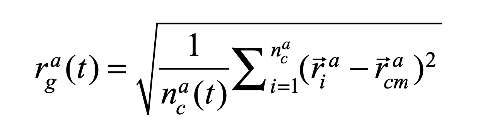
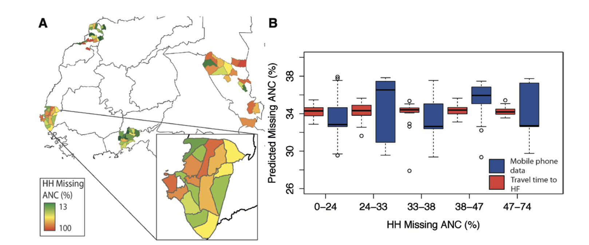

# Methodological Investigation
### Name: Yile Xu 
### Word Count: 1560 

### Introduction and Problem Statement: 
Despite of the considerable improvement on the public health conditions over the last decades, issues of health inequality and low coverage of public health services still constantly torment people in developing countries like Kenya. The disparities and inequalities of accessibility to public health care among different regions in Kenya can be attributed into three categories: affordability, availability, and geographical accessibility. Essentially, all these disparities on health care place burdens on Kenya’s health system and prevent the continuous improvement of its overall health state.  Major health burdens on Kenya’s public health system include relative high under-5 mortality rate of 51.3 per 1000 which decreased at a stagnant rate, high maternal mortality rate of 25.7 deaths per 10000, and high mortality caused by both communicable and noncommunicable diseases.

Therefore, alleviating health inequality should be considered as one of the most important development goals for Kenya. However, improving health equality is not an easy development process as there underlie many inherent problems which resist the health system to achieve equity. The most prominent one is the trade-offs between geographical equity and health system efficiency, which is hard to be balanced during the policy making process. Allocating health facilities in urban areas with more concentrated population will improve health system’s efficiency while this preferential deployment will exacerbate urban rural disparities and health inequality. Thus, new technologies are needed for analyzing the complex nature of health system, and my central research question is how data science methods can be applied to analyze and quantify health inequality issues within Kenya and provide insights for the improvement of health disparities and Kenyan’s equitable access to basic health services.

### Inquiry Type:
My investigation is more an exploratory inquiry as it mainly focuses on understanding and analyzing health inequality issues as a kind of developmental puzzle with the assist of geospatial methods. In order to alleviate this developmental puzzle, it is essential to figure out the inherent problems in this process which resist health system to reach equality.  Since health inequality is a really widely concerned and broad theme, my research question can be divided into several sub-questions: how to quantify the impact of unequal physical accessibility on health outcomes, assess variations of geographical accessibility to health facilities which is the most important component of health disparities, geographically analyze the variations of other barriers to health uptake like affordability and availability.  

### First method: Quantifying the Impact of Accessibility on Preventive Healthcare in Sub-Saharan Africa Using Mobile Phone Data 
Using anonymized mobile phone data from 2008 to 2009, the first geospatial model analyzed travel patterns of 14,816,521 subscribers across Kenya and then quantified the relationship between physical accessibility to healthcare, actual travel behavior of a community, and the degree of preventive healthcare uptake. From each subscribers, SMS communications and call detail records, which include the relative location to cell tower, sender, and receiver, are collected. With these data, researchers first modeled the individual mobility of each subscriber using a measure called the radius of gyration, which encompasses both the range and frequency traveled by a person, with higher values indicating more mobile subscribers. The primary location (center of mass) for each subscriber was determined based on the most common location over the course of the year. Based on the determined primary locations, the radius of gyration for subscribers from each mobile phone tower was calculated using the following formula: 

Then, the average radius-of-gyration values for every subscribers were aggregated to obtain the distributions of mobility for populations on 2 spatial scales: the county level and the individual cell tower level. Population distribution was mapped using land cover and census data while the travel time between pairs of locations was calculated using a cost–distance algorithm which computes the “cost” of traveling on a regular raster grid based on information on transportation network. In addition, to map the distribution of preventive healthcare uptake, researchers divided targeted region into 89 sublocations, and calculated the percentage of households who were lacking either completed childhood immunizations or antenatal care (as two outcome variables) using geocoded survey data of basic health conditions. After obtaining all the measurements needed, the mobility data were modeled with the estimated travel time to nearest health facilities and geocoded data on the uptake of two preventive healthcare interventions (Wesolowski, et al 2015).

The resulting statistics show that long travel times or poor physical access to healthcare is strongly correlated with increased mobility, which predicts more severe ignorance of preventive care of geographically isolated areas. This technique of using collected mobile phone data to map the uptake of preventive healthcare can be actively used as an important approach for quantifying the impact of poor physical access on the amount of health care received, providing insights for alleviating health disparities and the unequal geographical accessibility in the development process of Kenya’s public health system.  It contributes to answering part of my research question of health inequality, by providing methods to assess the health outcome of unequal physical access to health facilities. Collecting mobile phone data from incumbent mobile phone provider and developing models based on that is a valid and cost-effective method, but it may cause bias to some degrees. People in real low-income settlement may not have a mobile phone, which will lead to unrepresentative samples. Moreover, for reasons unknown, mobile phone data of February 2009 are missed from the data set. 

### Second method: Access to emergency hospital care provided by the public sector in sub-Saharan Africa in 2015: a geocoded inventory and spatial analysis

The second geospatial model examined the variations of population’s geographical access to emergency hospital services within and between 48 sub-Saharan Africa countries, which essentially lead to heterogeneous mortality rates. Since a threshold of less than 2 hours travel time is necessary for timely emergent hospital care like obstetrics and emergency surgical interventions, researchers used the proportion of population located more than 2 hour travel time to the nearest hospital as a major metric for geographical accessibility estimation. They first assembled a geocoded database of public hospitals with emergency services in sub-Saharan African. Data from national databases and international organizations like OCHA, WHO, and UNICEF were used to create the country-specific public hospital lists with their geographical coordinates indicated, and the missing coordinates of facilities were geocoded by Microsoft Encarta, Google Earth, and Geonames. Using a random forest technique, researchers disaggregated census data from WorldPop database to land use and land cover grids, and created total population mappings at 1 km^2 spatial resolution. Moreover, road network data which contain information about average motorised travel speeds were derived from Google Map Maker Project and OpenStreetMap using ArcMap, and major roads were classified as primary, secondary, and tertiary. In order to model travel time to the nearest public hospital, researchers first generated a travel impedance surface by assigning different travel speeds to roads classified in different level, and varied the motorized speeds by roughly 20% to define an upper and lower bound of travel speeds for sensitivity analysis. Non-road raster cells were assigned with a speeds of 5 km/h, assuming patients could walk or be carried. Then, based on both the impedance surface and location of public hospitals, travel time to the nearest facility was estimated using AccessMod(version 5) and mapped geographically, as shown on the figure below. (Paul, et al. 2018). 

The aggregated travel time mapping shows that 29% sub-Saharan Africa population are located more than 2 hour travel time from the nearest emergency hospital services, and significant variations in geographical accessibility exist between and within countries ranging from less than 25% of population within 2 hour travel time to more than 90%. From this research, both the geospatial model for travel time mapping and the first geocoded database of public hospitals in sub-Saharan Africa assembled can further contribute to the between and within country assessment of varied geographical accessibility to all different kinds of health services extending beyond emergency hospital services, which is the key of addressing limited health care received by geographically marginalized populations and alleviating public health disparities. It contributes to answering part of my research question regarding methods to map variations of geographical accessibility. Most data for this accessibility analysis were derived from sources of authority like government or international organization’s databases which can be considered as reliable. However, there are still some limitations. For example, they failed to incorporate frequency of transport services on secondary to main roads connected to hospital locations, the precise transport speeds, how prostrated emergency care patients are transported from households to arterial road networks, and the multitude of other physical and financial barriers into the model. 

### Conclusion: 
These two geospatial models complementarily answer different perspectives of my research question, and provide tools for health disparities analysis and alleviation in the development process of Kenya’s public health system. The first model quantifies the impact of poor physical access on corresponding healthcare uptake while the second one geographically maps the variations of access to emergency hospital services and calculates proportion of marginalized population as metrics for health inequality. However, these two geographical models are not enough for fully addressing my research question. They both focus on the variations of geographical accessibility, but for more in-depth health care assessments of Kenya, geospatial analysis considering other health barriers like the variations of affordability and availability of health services among different regions are still needed, which can be considered as a research gap.  

### Reference: 
Wesolowski, Amya, et al. “Quantifying the Impact of Accessibility on Preventive Healthcare in Sub-Saharan Africa Using Mobile Phone Data.” Epidemiology, Vol.26, 2015, pp. 223-228.

Paul O Ouma, et al. “Access to emergency hospital care provided by the public sector in sub-Saharan Africa in 2015: a geocoded inventory and spatial analysis.” Lancet Glob Health 2018; 6: e342–50

